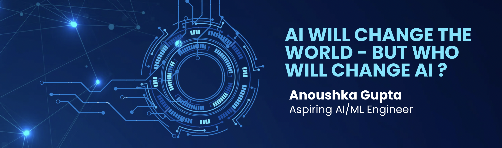

<!-- ===================== -->
<!--      PROFILE         -->
<!-- ===================== -->

<h1 align="center">Hi 👋, I'm Anoushka</h1>
<h3 align="center">Data Science • Machine Learning • Full-Stack Development</h3>

  
  

  <i>code • create • reflect • repeat ☁️</i>

---

## 🌱 About Me

- 🎓 Aspiring engineer with a love for **Data Science**, **Machine Learning**, and **Full-Stack Development**
- 🧠 Curious, consistent, and focused on strong fundamentals
- 🎹 **Grade 8 certified pianist** (Trinity College London)
- 😄 Pronouns: **She / Her**
- 🌸 Inspired by *Kaizen* — small steps, meaningful growth

---

## 🧠 What I’m Currently Learning

**📌 Foundations**
- Data Structures & Algorithms  
- Problem-solving patterns (LeetCode)

**🤖 Machine Learning**
- Core ML algorithms  
- scikit-learn  
- Implementing ML **from scratch** (math + intuition)

**🌐 Web Development**
- HTML, CSS, JavaScript  
- React.js  
- Flask

**🐍 Python Stack**
- Pandas • NumPy • Matplotlib  

---

## 🛠️ Featured Projects

### 🤖 Aasha  
*Conversational mental-health chatbot with emotion detection and grounding support*

### 📖 ReadShelf  
*Minimal, mood-based reading journal with AI-powered insights*

### 💡 ML from Scratch  
*Rebuilding ML algorithms to deeply understand the mathematics*

### 📈 LeetCode Tracker  
*Tracking DSA problems, solutions, and recurring patterns*

---

## 🧰 Tech Stack

  
  
  
  
  
  
  
  

---

## 🌟 GitHub at a Glance

  

---

## 🏆 GitHub Achievements

  

---

## 🎯 2025 Goals

- 🚀 Build **3+ full-stack projects**
- 🧩 Solve **100+ LeetCode problems**
- 📘 Complete **ML foundations + scikit-learn**
- 🇯🇵 Clear **JLPT N5 (Japanese)**

---

## 🧠 Learning Philosophy

> Start small. Stay consistent.  
> Build to understand — not just to finish.  
> Share learnings. Support others.

---

## 🌐 Let’s Connect & Collaborate

If you’re building something meaningful — or just learning together — I’m always happy to connect 🤝  

- 💼 [LinkedIn](https://www.linkedin.com/in/anoushka-gupta-331163319/)
- 💬 Reach out here on GitHub

  <b>Building thoughtful tech, one project at a time ✨</b>

---

<!--
anoushka1405/anoushka1405 is a ✨ special ✨ repository
because its README.md appears on your GitHub profile.
-->
